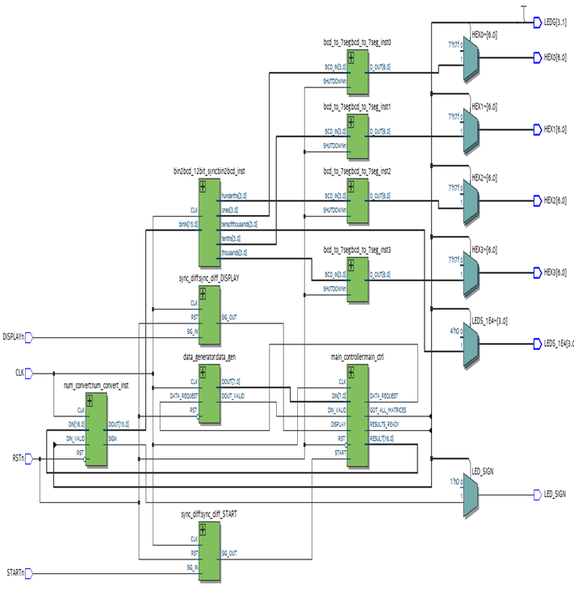
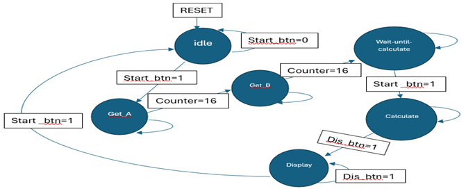
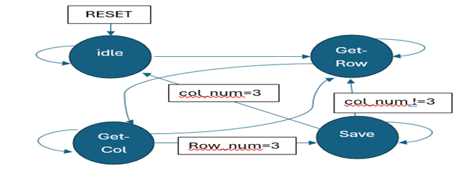
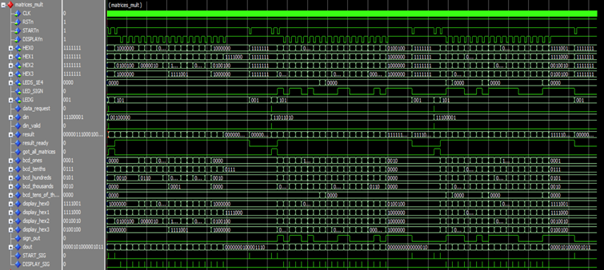
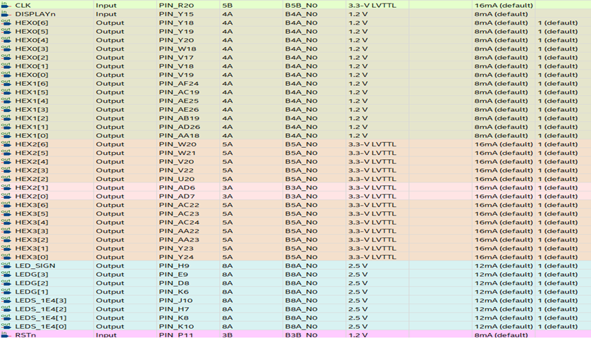

# **VHDL Matrix Multiplier - Final Project** 🖩⚡

This repository hosts the final project for the **Programmable Logic Devices** course (31551) at Braude Academic College. The project showcases a fully functional **4×4 matrix multiplier** designed in **VHDL**, simulated in **ModelSim**, synthesized using **Quartus Prime**, and deployed on an **Altera Cyclone V FPGA**.

---

## **📚 Project Overview**
The system performs matrix multiplication for two signed **4×4 matrices** and displays the computed result on **7-segment displays**. The implementation adheres to modular and structured design principles, using state machines and efficient resource utilization.

### **Workflow**
1. **Input Phase**:
   - Two 4×4 matrices are supplied via a **data generator**.
   - A `START` signal triggers the input process, and the matrices are stored in memory.

2. **Computation Phase**:
   - A **matrix multiplier module** calculates the result matrix.
   - The result is written back to memory for later retrieval.

3. **Output Phase**:
   - The result matrix is displayed on **7-segment displays** with additional LEDs for higher values.

4. **Reset/Restart Phase**:
   - Pressing the `START` button resets the system and prepares it for new inputs.

---

## **🎮 Features**
### **1. Modes of Operation**
- **Idle Mode**:
  - The system initializes and waits for input.
- **Input Mode**:
  - Sequential input of matrix elements is managed automatically.
- **Compute Mode**:
  - The system performs matrix multiplication in an optimized sequence.
- **Display Mode**:
  - Displays results matrix element by element with navigation controls.

### **2. Control Signals**
- **START**: Begins input, computation, or resets the system.
- **DISPLAY**: Advances through displayed results one element at a time.

---

## **🖼️ Visuals**

### **1. System Block Diagram**
This diagram provides a high-level overview of the system's architecture, including major modules like the **Data Generator**, **Matrix Multiplier**, and **Main Controller**.

---

### **2. State Machine Diagram**
The finite state machine (FSM) for the **Main Controller** manages the transitions between modes. Here's a detailed view:

---

### **3. Simulation Results**
A snippet of simulation output, showcasing the correct computation of matrix multiplication:

---

### **4. FPGA Hardware Setup**
The project is implemented on the **Altera Cyclone V FPGA development board**. Below is the hardware setup for deployment and testing:

